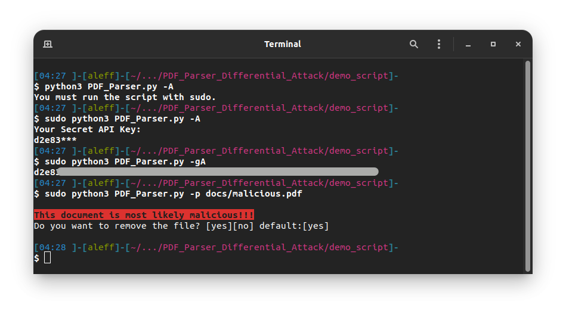

# PDF-Parser-VirusTotal-based
PDF Parser based on VirusTotal API
[](https://hits.seeyoufarm.com)

## Licence
 

## Components


## Language Used


## OS Tested


## OS UnTested
 

## Terminal helper


## Example


## Log file example


## How to use

If you want to try this tool you can use a [malicious file](docs/malicious.pdf) in docs created with metasploit.

[](https://youtu.be/qY1oc1xyU5A)

Use the command -h or --help for receive the following output...

```
-p		PDF file path to analyze
    or --path

-A		Set your VirusTotal API Key
    or --API-Key

-gA		Print your VirusTotal API Key
    or --Get-API-Key

-v		Use this argoument for view a lot more information
    or --verbose

-l		Save in a log file all verbose information
    or --log


Examples:

Set your API:
$ sudo python3 script.py -A <VirusTotal_API_Key>

See your API:
$ sudo python3 script.py -gA

Scan a pdf:
$ sudo python3 script.py -p malicious.pdf

Verbose output:
$ sudo python3 script.py -p malicious.pdf --verbose

Save a in a log file:
$ sudo python3 script.py -p malicious.pdf --log
```

## Argouments

|Argoument|Required|Format|
|--|--|--|
|--path|yes|-p /home/aleff/Documents/malicious.pdf|
||or ->|-p malicious.pdf|
|--API-Key|yes|-A|
|--verbose|no|-v|
|--log|no|-l|
|--Get-API-Key|no|-gA|

## VirusTotal API

Signup to [VirusTotal Website](https://www.virustotal.com/gui/join-us) and go to Account -> API Key

## FAQs

### Why?
- Developed for Network Security course of UNICAL Univeristy
